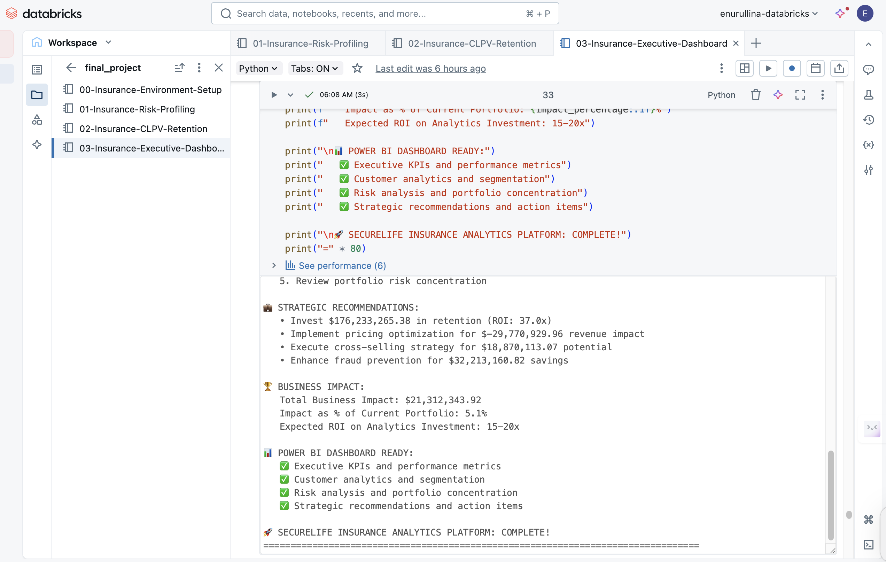

# Insurance Analytics Platform – Azure AI Data Engineering Project

**SecureLife Insurance | July 2025**
**Role:** Data Engineer
**Tech Stack:** Azure Databricks (PySpark), Azure Data Factory, Power BI

---

## Project Overview

This enterprise-grade analytics platform was built to solve real-world business challenges for **SecureLife Insurance**. As a **Data Engineer**, I developed and deployed a scalable pipeline and advanced analytical models to support decision-making in **pricing**, **retention**, **fraud detection**, and **risk assessment**.

---

## Business Impact

The platform was designed to directly improve:

* 📈 **Revenue** through dynamic pricing and CLPV modeling
* 🤝 **Customer Retention** via predictive renewal scoring
* 🔍 **Fraud Detection** using claims pattern analysis
* 🎯 **Strategic Investment** through segmentation and CLPV insights

---

## Architecture Highlights

### 4-Notebook Modular Structure (Azure Databricks)

| Notebook                                 | Purpose                                                         |
| ---------------------------------------- | --------------------------------------------------------------- |
| `00-Insurance-Environment-Setup.ipynb`   | Data ingestion, schema validation, referential integrity checks |
| `01-Insurance-Risk-Profiling.ipynb`      | Customer risk scoring, seasonal patterns, segmentation          |
| `02-Insurance-CLPV-Retention.ipynb`      | CLPV modeling, fraud detection, renewal predictions             |
| `03-Insurance-Executive-Dashboard.ipynb` | KPI calculations, export-ready dataset for BI                   |

---

### Pipeline Orchestration (Azure Data Factory)

* **ADF Pipeline Name**: `InsuranceAnalyticsPipeline`
* Sequential execution of notebooks 0 → 1 → 2 → 3
* Daily trigger at **4:00 AM**
* **Web alerts**: Slack/Email success & failure notifications
* Configured retry logic and error handling

---

### Power BI Dashboard

| Page                            | Features                                                                                      |
| ------------------------------- | --------------------------------------------------------------------------------------------- |
| **1. Executive Overview**       | KPIs (Total Premiums, Loss Ratio, Customer Count, Retention Rate), Trend & Map visualizations |
| **2. Customer Analytics**       | CLPV distribution, Risk vs Value matrix, Segmentation tables                                  |
| **3. Claims & Risk Analysis**   | Claims trends, High-risk customer tables, Bar charts by policy type                           |
| **4. Business Recommendations** | Actionable insights grid, ROI-focused strategies, KPI cards                                   |

---

## Project Files

| File                                     | Description                                             |
| ---------------------------------------- | ------------------------------------------------------- |
| `00-Insurance-Environment-Setup.ipynb`   | Environment, data validation setup, quality validation  |
| `01-Insurance-Risk-Profiling.ipynb`      | Risk profiling and portfolio analysis                   |
| `02-Insurance-CLPV-Retention.ipynb`      | Lifetime value and predictive modeling                  |
| `03-Insurance-Executive-Dashboard.ipynb` | BI preparation and KPI generation                       |
| `InsuranceAnalyticsPipeline.json`        | ARM Template for Azure Data Factory pipeline            |
| `InsuranceAnalyticsDashboard.pbix`       | Power BI dashboard file                                 |
| `Insurance_Analytics_Presentation.pdf`   | 8-minute business presentation slides                   |
| `PipelineExecution_Screenshots.pdf`      | ADF execution and trigger setup proof                   |
| `ProjectSummary.pdf`                     | Executive summary for stakeholders                      |
| `*.csv (x10)`                            | Final exports from Databricks for Power BI              |

---

## Key Achievements

* Built an **end-to-end cloud pipeline** on the Azure ecosystem using PySpark + ADF + Power BI
* Designed **modular, scalable code architecture** following enterprise standards
* Integrated **business logic into technical models** to produce high-value executive KPIs
* Demonstrated **project leadership** by managing delivery, QA, documentation, and presentation
* Aligned technical outcomes with **insurance industry needs and ROI goals**

---

## Skills Demonstrated

* Azure Databricks (PySpark), Delta Lake
* Azure Data Factory orchestration (ARM, scheduling, alerts)
* Power BI dashboard development
* CLPV modeling, fraud detection, predictive analytics
* Insurance KPI strategy: Retention Rate, Loss Ratio, Premium Trends
* Data validation, referential integrity, data quality assurance
* Business storytelling, stakeholder presentation

---

## Ideal For

This project is ideal for demonstrating skills aligned with:

* **Data Engineering roles** (Junior/Mid)
* **Azure Platform Development**
* **Business Intelligence & Data Analytics**
* **Insurance / FinTech Data Teams**

## Summary

### Real Business Impact

  - Tackled critical insurance challenges like risk profiling, pricing optimization, fraud detection, and customer retention.
  - Translated complex datasets into actionable insights using Azure-native tools.
  - Created executive dashboards to support data-driven decisions and strategic planning.

### Cloud-Native Architecture (Azure)
  
  - Used Azure Databricks (PySpark) for scalable data processing.
  - Automated workflows with Azure Data Factory, simulating real production pipelines.
  - Delivered insights with Power BI, a leading business intelligence tool integrated in Azure.

### Career-Aligned Experience

  - Demonstrated end-to-end data engineering: ingestion → transformation → modeling → visualization.
  - Built with modular 4-notebook architecture reflecting enterprise standards.
  - Practiced CI/CD-like orchestration via ADF with retry logic, alerting, and scheduling.

### Why AI + Data Engineering?

  - Integrated predictive analytics like CLPV modeling and renewal predictions using PySpark.
  - Focused on AI-enhanced insights instead of just dashboards—bridging data engineering with machine learning fundamentals.

## This project showcases:

  - Cloud platform skills (Azure Databricks, ADF, Power BI)
  - Big data processing (PySpark on large datasets)
  - Business understanding (insurance KPIs, fraud indicators)
  - Professional delivery (documentation, presentation, automation)

---

## Related Links

* **Power BI Dashboard**
  
  

  

  

  
  
* **Project Repo** – \[GitHub Link](https://github.com/ElenkaSan/Insurance_Analytics_Platform)
* **Portfolio** – 
* Author: [Elena Nurullina](https://github.com/ElenkaSan)